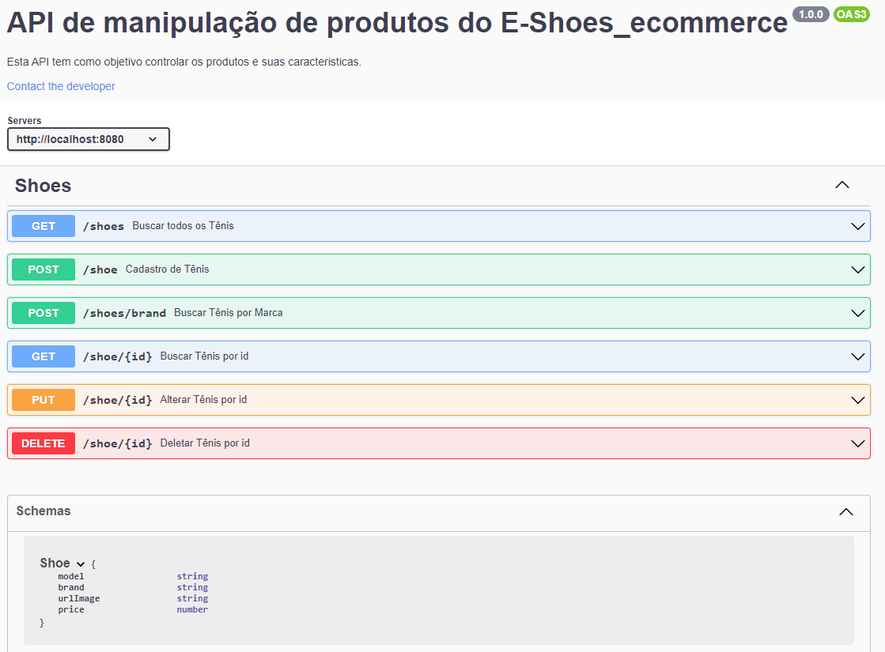

<h1 align="center">
    <p>API de Produtos do E-shoes</p>
</h1>

<h4 align="center"> 
	90% Concluído 🚀 🚧
</h4>

<p align="center">
 <a href="#-sobre-o-projeto">Sobre</a> •
 <a href="#-funcionalidades">Funcionalidades</a> •
 <a href="#-testar-api-online">Testar API Online</a> • 
 <a href="#-como-executar-o-projeto">Como executar</a> • 
 <a href="#-tecnologias">Tecnologias</a> 
</p>

## 💻 Sobre o projeto

O projeto trata-se de uma APIRest dos produtos oferecidos no [**E-shoes Ecommerce**](https://github.com/RenatoAlbuquerque/E-shoes_ecommerce-FrontEnd).

---

## ⚙️ Funcionalidades

- [x] O Admistrador pode:
  - [x] Cadastrar um novo tênis.
  - [x] Alterar um tênis já cadastrado.
  - [x] Excluir um tênis já cadastrado.
  - [x] Além de pesquisar:
    - Por todos os tênis.
    - Por um tênis de ID específico.
    - Por tênis de marcas específicas.

---

## 🚀 Como executar o projeto

Este projeto é divido em três partes:

1. Backend Products
2. Backend Ecommerce
3. Frontend

💡Apenas para a utilização do Frontend é necessário executar os projetos de backend, o contrário não se aplica.

### Pré-requisitos

Antes de começar, você vai precisar ter instalado em sua máquina as seguintes ferramentas:
[Git](https://git-scm.com), [Node.js](https://nodejs.org/en/).
Além disto é bom ter um editor para trabalhar com o código como [VSCode](https://code.visualstudio.com/)

### Testar API Online

Para documentação e facilitar a utilização dos teste da API foi utilizado o [Swagger](https://swagger.io/), o qual a página esta disponibilizado na rota [**/api-docs**](https://backend-products-eshoes.herokuapp.com/api-docs/).

<h1 align="center">
    
</h1>

#### 🎲 Rodando o Backend (servidor)

```bash
# Clone este repositório
$ git clone https://github.com/RenatoAlbuquerque/E-shoes_ecommerce-BackEnd-Products
# Acesse a pasta do projeto no terminal/cmd
$ cd E-shoes_ecommerce-BackEnd-Products
# Vá para a pasta server
$ cd src
# Instale as dependências
$ npm install
# Crie uma pasta com a extensão env para utilizar as variavéis de ambiente
$ mkdir .env
# Preencha as varivéis de ambiente do seu projeto de acordo com seu banco de dados mongoDB e a sua preferência.
$ DB_NAME / DB_USER / DB_PASSWORD / PORT
# Execute a aplicação em modo de desenvolvimento
$ npm run dev
# O servidor inciará na porta:8080 - acesse http://localhost:8080
```

---

## 🛠 Tecnologias

As seguintes ferramentas foram usadas na construção do projeto:

#### [](https://github.com/tgmarinho/Ecoleta#server-nodejs--typescript)**Server** ([NodeJS](https://nodejs.org/en/) + [TypeScript](https://www.typescriptlang.org/))

- **[Express](https://expressjs.com/)**
- **[CORS](https://expressjs.com/en/resources/middleware/cors.html)**
- **[Mongoose](https://mongoosejs.com/)**
- **[Swagger](https://swagger.io/)**
- **[ts-node](https://github.com/TypeStrong/ts-node)**
- **[dotENV](https://github.com/motdotla/dotenv)**

> Veja o arquivo [package.json](https://github.com/RenatoAlbuquerque/E-shoes_ecommerce-BackEnd-Products/blob/main/package.json)

---
